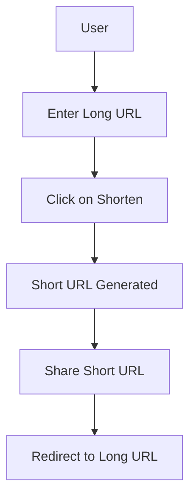

# TURL (Tiny URL)

### What is TURL?
* TURL(Tiny URL) is a URL shortening service that allows users to shorten long URLs into short URLs. It is a simple and easy-to-use service that can be used to shorten URLs for sharing in emails, or in any other situation where a long URL is not ideal.

### How does TURL work?
* TURL works by taking a long URL and generating a unique short URL for it. When a user visits the short URL, they are redirected to the original long URL.

### Flowchart

### Swagger API Documentation
* [API Docs](https://turl-test-backend.apps.silver.devops.gov.bc.ca/api/docs)

This repository is provided by NRIDS Architecture and Forestry Digital Services, courtesy of the Government of British Columbia.
